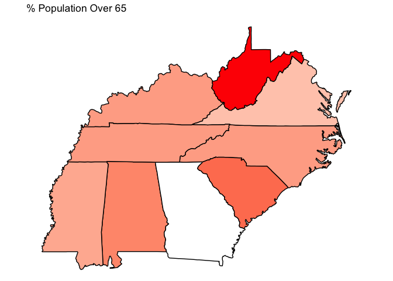
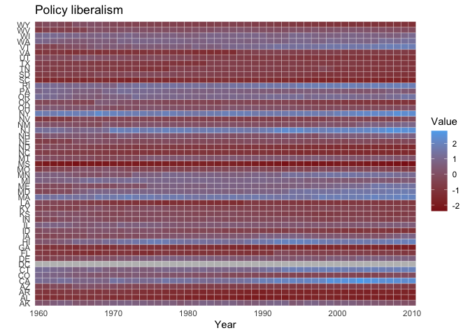
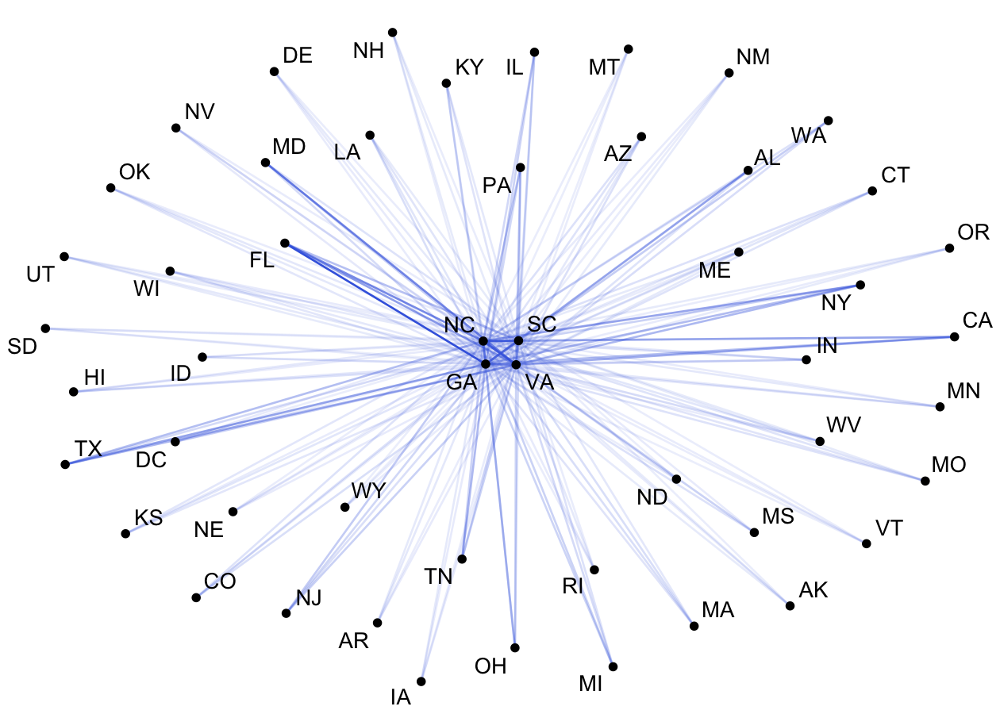
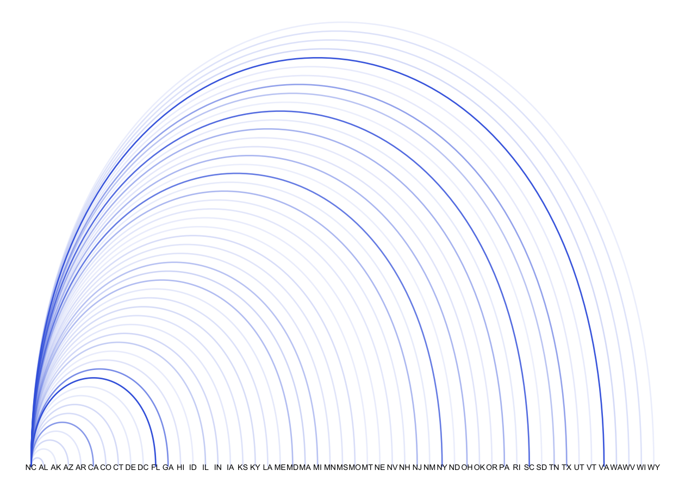

<!-- README.md is generated from README.Rmd. Please edit that file -->

# cspp: A Tool for the Correlates of State Policy Project Data 

<!-- badges: start -->

[](https://cran.r-project.org/package=cspp)
[](https://cran.r-project.org/package=cspp)
<!-- badges: end -->

**cspp** is a package designed to allow a user with only basic knowledge
of R to find variables on state politics and policy, create and export
datasets from these variables, subset the datasets by states and years,
create map visualizations, and export citations to common file formats
(e.g., `.bib`). An associated web application is available
[here](https://cspp.ippsr.msu.edu/cspp/).

## Recent Updates:

– Added integration with `csppData` to allow use of the most recent CSPP
data (version 2.4)

– Added the `corr_plot` function which allows the creation of
correlation plots and correlation matrices.

– Added the `plot_panel` function which facilitates the creation of
timeseries plots.

– Added the `core` argument to the `get_cspp_data` function. Set it to
`TRUE` to merge in common and important variables from the CSPP data.
Useful for teaching purposes.

– Added integration with csppData, a package we created to hold the
Correlates of State Policy Project data and codebook. The CSPP data is
not provided with this package now. It instead automatically loads the
csppData package and its data.

## The Correlates of State Policy

[The Correlates of State Policy
Project](http://ippsr.msu.edu/public-policy/correlates-state-policy)
compiles more than 2,000 variables across 50 states (+ DC) from
1900-2020. The variables cover 16 broad categories:

- Demographics and Population
- Economic and Fiscal Policy
- Government
- Elections
- Policy Scores and Public Opinion
- Criminal Justice and the Legal System
- Education
- Healthcare and Health Insurance
- Welfare Policy
- Rights and Anti-Discrimination Protections
- Environment
- Drug and Alcohol Policy
- Gun Control
- Labor
- Transportation
- Regulatory Policy

## Basic Use: Finding and Returning State Politics Data

``` r
# For latest developmental verison:
library(devtools)
devtools::install_github("correlatesstatepolicy/cspp")

# For CRAN version:
install.packages("cspp")
```

The primary functions in this package are `get_var_info` and
`get_cspp_data`. The basic workflow for using this package is to 1) find
variables of interest and 2) pull them from the full data into a
dataframe within the R environment. Below is a basic working example.

``` r
# Load the package
library(cspp)

# Find variables based on a category
demo_variables <- get_var_info(categories = "demographics")

# Use these variables to get a full or subsetted version of the data
cspp_data <- get_cspp_data(vars = demo_variables$variable, 
                           years = seq(2000, 2010))
```

The `get_cspp_data` function returns a properly formatted state-year
panel, facilitating regressions and merging based on common state
identifiers.

``` r
library(dplyr)
glimpse(cspp_data[1:15],)
#> Rows: 561
#> Columns: 15
#> $ st            <chr> "AK", "AK", "AK", "AK", "AK", "AK", "AK", "AK", "AK", "A…
#> $ stateno       <dbl> 2, 2, 2, 2, 2, 2, 2, 2, 2, 2, 2, 1, 1, 1, 1, 1, 1, 1, 1,…
#> $ state         <chr> "Alaska", "Alaska", "Alaska", "Alaska", "Alaska", "Alask…
#> $ state_fips    <dbl> 2, 2, 2, 2, 2, 2, 2, 2, 2, 2, 2, 1, 1, 1, 1, 1, 1, 1, 1,…
#> $ state_icpsr   <dbl> 81, 81, 81, 81, 81, 81, 81, 81, 81, 81, 81, 41, 41, 41, …
#> $ year          <dbl> 2000, 2001, 2002, 2003, 2004, 2005, 2006, 2007, 2008, 20…
#> $ poptotal      <dbl> 627428, 633160, 642391, 650426, 660975, 668625, 676301, …
#> $ popdensity    <dbl> NA, NA, NA, NA, NA, NA, NA, NA, NA, NA, NA, NA, NA, NA, …
#> $ popfemale     <dbl> 302820, NA, 310665, 313539, 316525, 320479, 323642, 3286…
#> $ pctpopfemale  <dbl> NA, NA, NA, NA, NA, NA, NA, NA, NA, NA, NA, NA, NA, NA, …
#> $ popmale       <dbl> 324112, NA, 333121, 335279, 338910, 343182, 346411, 3548…
#> $ pctpopmale    <dbl> NA, NA, NA, NA, NA, NA, NA, NA, NA, NA, NA, NA, NA, NA, …
#> $ popunder5     <dbl> 47591, NA, 49477, 48680, 49758, 50741, 49771, 51311, 520…
#> $ pctpopunder14 <dbl> NA, NA, NA, NA, NA, NA, NA, NA, NA, NA, NA, NA, NA, NA, …
#> $ pop5to17      <dbl> 143126, NA, 142951, 140609, 138471, 137583, 131663, 1309…
```

Even more generally, you can load the entire set of variables and/or the
entire set of data (all 900+ variables) into R through passing these
functions without any parameters:

``` r
# All variables
all_variables <- get_var_info()

# Full dataset
all_data <- get_cspp_data()
#> Note: the following variables have additional footnotes in the codebook (https://ippsr.msu.edu/sites/default/files/CorrelatesCodebook.pdf):
#> bfh_cpi_multiplier, gov_fin_fy, housing_prices_quar, noofvotes, cartheftrate, carthefttotal, murderrate, murdertotal, propcrimerate, propcrimetotal, raperate, rapetotal, bus_energy_consum, bus_energy_consum_pc
```

## Finding Variables

Given the large number of variables in the data, we provide additional
functionality within `get_var_info` to search for variables based on
strings or categories. For instance, the following searches for `pop`
and `femal` within the variable name, returning 31 variables:

``` r
# Search for variables by name
get_var_info(var_names = c("pop","femal")) %>% dplyr::glimpse()
#> Rows: 43
#> Columns: 14
#> $ variable        <chr> "poptotal", "popdensity", "popfemale", "pctpopfemale",…
#> $ years           <chr> "1900-2019", "1975-1999", "1994-2000, 2002-2010", "201…
#> $ short_desc      <chr> "Population total", "Population density", "Female popu…
#> $ long_desc       <chr> "Total population per state", "Number of people per sq…
#> $ sources         <chr> "U.S. Census Bureau (http://www.census.gov/)\r\nOrigin…
#> $ category        <chr> "demographics", "demographics", "demographics", "demog…
#> $ plaintext_cite  <chr> "Stateminder: A data visualization project from George…
#> $ bibtex_cite     <chr> "@misc{stateminderNA,\n  title={Stateminder.org},\n  a…
#> $ plaintext_cite2 <chr> NA, NA, NA, NA, NA, NA, NA, NA, NA, NA, NA, NA, NA, NA…
#> $ bibtex_cite2    <chr> NA, NA, NA, NA, NA, NA, NA, NA, NA, NA, NA, NA, NA, NA…
#> $ plaintext_cite3 <chr> NA, NA, NA, NA, NA, NA, NA, NA, NA, NA, NA, NA, NA, NA…
#> $ bibtex_cite3    <chr> NA, NA, NA, NA, NA, NA, NA, NA, NA, NA, NA, NA, NA, NA…
#> $ plaintext_cite4 <chr> NA, NA, NA, NA, NA, NA, NA, NA, NA, NA, NA, NA, NA, NA…
#> $ bibtex_cite4    <chr> NA, NA, NA, NA, NA, NA, NA, NA, NA, NA, NA, NA, NA, NA…
```

A similar line of code using the `related_to` parameter, instead of
`var_name`, searches within the name **and** the description fields,
returning 96 results:

``` r
# Search by name and description:
get_var_info(related_to = c("pop", "femal")) %>% dplyr::glimpse()
#> Rows: 139
#> Columns: 14
#> $ variable        <chr> "poptotal", "popdensity", "popfemale", "pctpopfemale",…
#> $ years           <chr> "1900-2019", "1975-1999", "1994-2000, 2002-2010", "201…
#> $ short_desc      <chr> "Population total", "Population density", "Female popu…
#> $ long_desc       <chr> "Total population per state", "Number of people per sq…
#> $ sources         <chr> "U.S. Census Bureau (http://www.census.gov/)\r\nOrigin…
#> $ category        <chr> "demographics", "demographics", "demographics", "demog…
#> $ plaintext_cite  <chr> "Stateminder: A data visualization project from George…
#> $ bibtex_cite     <chr> "@misc{stateminderNA,\n  title={Stateminder.org},\n  a…
#> $ plaintext_cite2 <chr> NA, NA, NA, NA, NA, NA, NA, NA, NA, NA, NA, NA, NA, NA…
#> $ bibtex_cite2    <chr> NA, NA, NA, NA, NA, NA, NA, NA, NA, NA, NA, NA, NA, NA…
#> $ plaintext_cite3 <chr> NA, NA, NA, NA, NA, NA, NA, NA, NA, NA, NA, NA, NA, NA…
#> $ bibtex_cite3    <chr> NA, NA, NA, NA, NA, NA, NA, NA, NA, NA, NA, NA, NA, NA…
#> $ plaintext_cite4 <chr> NA, NA, NA, NA, NA, NA, NA, NA, NA, NA, NA, NA, NA, NA…
#> $ bibtex_cite4    <chr> NA, NA, NA, NA, NA, NA, NA, NA, NA, NA, NA, NA, NA, NA…
```

You can also return whole categories of variables. The full list of
variable categories is available within the help file for
`?get_cspp_data`. You can alternatively see the list of categories
through the below snippet of code.

``` r
# See variable categories:
unique(get_var_info()$category)
#>  [1] "demographics"     "economic-fiscal"  "government"       "elections"       
#>  [5] "policy-ideology"  "criminal justice" "education"        "healthcare"      
#>  [9] "welfare"          "rights"           "environment"      "drug-alcohol"    
#> [13] "gun control"      "labor"            "transportation"   "misc. regulation"
```

``` r
# Find variables by category:
var_cats <- get_var_info(categories = c("gun control", "labor"))
```

You can then use the variable column in this dataframe to pull data from
`get_cspp_data` through `var_cats$variable`, an example of which is
below.

Another option in finding a variable is to load the variables into a
dataframe and use RStudio’s filter feature to search:


## Pulling data

The function `get_cspp_data` takes the following parameters, all of
which are optional:

- `vars` - The specific (exact match) variable(s) to pull. Takes a
  single variable or a vector of variable names.
- `var_category` - The category or categories from which to pull. Takes
  a single category or vector of categories from the 16 listed above.
- `states` - Select which states to grab data from. States must be
  abbreviated and can take a vector or individual state. See
  `?state.abb` for an easy way to load state abbreviations.
- `years` - Takes a single year or a vector or sequence of years, such
  as `seq(2001, 2005)`.
- `output` - Choose to write the resulting dataframe straight to a file.
  Optional outputs include `csv`, `dta`, or `rdata`.
- `path` - If outputting the file, choose where to write it to. If left
  blank, the file will save to your working directory.

In this example, the resulting dataframe includes the variables
`c("sess_length", "hou_majority", "term_length")` as well as all
variables in the category `demographics` for North Carolina, Virgina,
and Georgia from 1994 to 2004.

``` r
# Get subsetted data and save to dataframe
data <- get_cspp_data(vars = c("sess_length", "hou_majority", "term_length"),
                      var_category = "demographics",
                      states = c("NC", "VA", "GA"),
                      years = seq(1995, 2004))
```

You can also pass the `get_var_info` function into the `vars` parameter
of `get_cspp_data`, skipping a step:

``` r
# Use get_var_info to generate variable vector inline
get_cspp_data(vars = get_var_info(related_to = "concealed carry")$variable,
              states = "NC",
              years = 1999)
#> # A tibble: 1 × 8
#>   st    stateno state          state_fips state_icpsr  year bjourn bprecc
#>   <chr>   <dbl> <chr>               <dbl>       <dbl> <dbl>  <dbl>  <dbl>
#> 1 NC         33 North Carolina         37          47  1999      2      1
```

Where the two returned variables, `bjourn` and `bprecc`, deal with
concealed carry of guns in motor vehicles and whether state laws
pre-empt local laws, respectively.

### Citations

Each variable in the CSPP data was collected from external sources.
We’ve made it easy to cite the source of each variable you use with the
`get_cites` function.

This function takes a variable name or vector of variable names (such as
that generated by the `get_var_info` function) and returns a dataframe
of citations.

``` r
# Simple dataframe for one variable
get_cites(var_names = "poptotal") %>% dplyr::glimpse()
#> Rows: 3
#> Columns: 12
#> $ variable        <chr> "poptotal", "cspp_dataset", "cspp_package"
#> $ plaintext_cite  <chr> "Stateminder: A data visualization project from George…
#> $ bibtex_cite     <chr> "@misc{stateminderNA,\n  title={Stateminder.org},\n  a…
#> $ plaintext_cite2 <chr> NA, NA, NA
#> $ bibtex_cite2    <chr> NA, NA, NA
#> $ plaintext_cite3 <chr> NA, NA, NA
#> $ bibtex_cite3    <chr> NA, NA, NA
#> $ years           <chr> "1900-2019", NA, NA
#> $ short_desc      <chr> "Population total", NA, NA
#> $ long_desc       <chr> "Total population per state", NA, NA
#> $ sources         <chr> "U.S. Census Bureau (http://www.census.gov/)\r\nOrigin…
#> $ category        <chr> "demographics", NA, NA

# Using get_var_info to return variable citations
cite_ex <- get_cites(var_names = get_var_info(related_to = "concealed carry")$variable)
cite_ex$plaintext_cite[3:4]
#> [1] "Jordan, Marty P. and Matt Grossmann. 2020. The Correlates of State Policy Project v.2.2. East Lansing, MI: Institute for Public Policy and Social Research (IPPSR)."
#> [2] "Caleb Lucas and Joshua McCrain (2020). cspp: A Package for The Correlates of State Policy Project Data. R package version 0.1.0."
```

There is also an option to output the citations to a .bib, .csv or .txt
file:

``` r
get_cites(var_names = "poptotal",
         write_out = TRUE,
         file_path = "~/path/to/file.csv",
         format = "csv")
```

## Maps and Choropleths

The `generate_map` function uses the CSPP data to generate US maps with
states filled in based on the value of a given variable (also called
choropleths). This function returns a `ggplot` object so it is highly
customizable. The optional parameters are:

- `cspp_data` - A dataframe ideally generated by the `get_cspp_data`
  function. Any dataframe will work as long as it has the columns
  `st.abb`, `year`, and any additional column from which to fill in the
  map.
- `var_name` - The specific variable to use to fill in the map. If left
  blank, it will take the first column after `year` and `st.abb`.
- `average_years` - Default is FALSE. If set to TRUE, this returns a map
  that averages over all of the years per state in the dataframe. So if
  there are multiple years of population per state, it plots the average
  population per state in the panel.
- `drop_NA_states` - By default, the function keeps states that are
  missing data, resulting in them being filled in as gray. If this is
  set to TRUE, the states are dropped. See the example below.
- `poly_args` - A list of arguments that determine the aesthetics of
  state shapes. See `ggplot2::geom_polygon` for options.

**Note**: This function will attempt to plot any variable type; however,
plotting character or factor values on a map will likely result in a
hard to interpret graph.

``` r
library(ggplot2) # optional, but needed to remove legend

# Generates a map of the percentage of the population over 65
generate_map(get_cspp_data(var_category = "demographics"),
             var_name = "pctpopover65") +
  ggplot2::theme(legend.position = "none")
```


In this example, since the dataframe passed is generated by
`get_cspp_data(var_category = "demographics")` and contains all years
for all states in the data, the function by default returns the value of
the most recent year without missing data.

If you set `drop_NA_states` to TRUE, and pass the function a dataframe
containing only certain states, it only plots those states:

``` r
library(dplyr)

generate_map(get_cspp_data(var_category = "demographics") %>%
                dplyr::filter(st %in% c("NC", "VA", "SC")),
              var_name = "pctpopover65",
              poly_args = list(color = "black"),
              drop_NA_states = TRUE) +
  ggplot2::theme(legend.position = "none")
```


Since this function returns a `ggplot` object, you can customize it
endlessly:

``` r
generate_map(get_cspp_data(var_category = "demographics") %>%
                dplyr::filter(st %in% c("NC", "VA", "SC", "TN", "GA", "WV", "MS", "AL", "KY")),
              var_name = "pctpopover65",
              poly_args = list(color = "black"),
              drop_NA_states = TRUE) +
  ggplot2::scale_fill_gradient(low = "white", high = "red") +
  ggplot2::theme(legend.position = "none") +
  ggplot2::ggtitle("% Population Over 65")
```



## Plot timeseries data

To facilitate the visualization of the timeseries and panel nature of
the CSPP data, the `plot_panel` function takes a dataframe from
`get_cspp_data` and plots a state-year panel in one of two formats. The
parameters of this function are as follows:

- `cspp_data` - a dataframe generated by `get_cspp_data` or,
  alternatively, a dataframe with the columns `st.abb`, `year`, plus one
  other variable.
- `var_name` - the name of the variable to be plotted.
- `years` - the years to include in the panel.
- `colors` - three color values that are used in the plot. The first
  color takes the lowest values of the variable, the second the highest,
  and the third is the color used for NA values.
- `plot_type` - one of “grid” or “line”. Defaults to “grid”. Both are
  displayed next.

The function returns a `ggplot2` object, making it easier to change and
add layers onto the generated plot.

A common research design is to use variation in policy adoption as a
‘treatment’ in a pseudo-experimental setting. This function makes it
easy to visualize when states are subject to this treatment.

``` r
# panel of all states' adoption of medical marijuana laws
cspp <- get_cspp_data(vars = "drugs_medical_marijuana")

# visualize panel:
plot_panel(cspp)
#> Values from drugs_medical_marijuana used to fill cells.
```


The function also works with continuous variables, such as the state
policy liberalism score:

``` r
plot_panel(cspp_data = get_cspp_data(vars = "pollib_median"),
           colors = c("firebrick4", "steelblue2", "gray"),
           years = seq(1960, 2010)) +
  ggplot2::ggtitle("Policy liberalism")
#> Values from pollib_median used to fill cells.
```



## Correlation Plots and Matrices

The `corr_plot` function geneates a correlation plot (in the style of a
heat map) using `ggcorrplot`. Alternately, it outputs a correlation
matrix for users to pass onto their own `ggcorrplot` call for further
customization.

This function takes the following parameters: \* `data` - a dataframe.
If generated by `get_cspp_data`, the function will work automatically.
Otherwise, this function parses all numeric columns in the passed
dataframe. \* `vars`- a vector of variable names to generate
correlations between. \* `summarize` - whether to create state specific
means for each variable. If set to TRUE, passed dataframe must contain
the column `st.abb`. If FALSE, it will treat each observation
independently in generating correlations. \* `labels` - whether to
include labels on the correlation plot of the specific correlation
value. \* `label_size` - the font size of the labels. \* `colors` - a
vector of three colors that form the gradient in the plot. \*
`cor_matrix` - if set to TRUE, instead of returning a ggplot object this
function returns a correlation matrix.

``` r
corr_plot(data = get_cspp_data(years = seq(1990, 2010)),
          vars = c("pollib_median", "innovatescore_boehmkeskinner", "citi6013", "ranney4_control", "h_diffs"),
          colors = c("dodgerblue", "white", "firebrick"))
```


Alternatively, you can use similar code to generate a correlation
matrix:

``` r
corr_plot(data = get_cspp_data(years = seq(1990, 2010)),
          vars = c("pollib_median", "innovatescore_boehmkeskinner", "citi6013", "ranney4_control", "h_diffs"),
          cor_matrix = TRUE)
#>                              pollib_median innovatescore_boehmkeskinner
#> pollib_median                          1.0                          0.3
#> innovatescore_boehmkeskinner           0.3                          1.0
#> citi6013                               0.8                          0.2
#> ranney4_control                        0.4                          0.4
#> h_diffs                                0.2                          0.2
#>                              citi6013 ranney4_control h_diffs
#> pollib_median                     0.8             0.4     0.2
#> innovatescore_boehmkeskinner      0.2             0.4     0.2
#> citi6013                          1.0             0.4    -0.1
#> ranney4_control                   0.4             1.0    -0.1
#> h_diffs                          -0.1            -0.1     1.0
```

## Network data

The function `get_network_data` returns a dataset from the [CSPP state
networks data](http://ippsr.msu.edu/public-policy/state-networks)
consisting of 120 variables. The data is structured as state dyads (an
edge list).

``` r
# Returns dataframe of state dyads
get_network_data() %>% dplyr::glimpse()
#> Rows: 2,550
#> Columns: 120
#> $ State1                     <chr> "Alabama", "Alabama", "Alabama", "Alabama",…
#> $ State2                     <chr> "Alaska", "Arizona", "Arkansas", "Californi…
#> $ st.abb2                    <chr> "AK", "AZ", "AR", "CA", "CO", "CT", "DE", "…
#> $ st.abb1                    <chr> "AL", "AL", "AL", "AL", "AL", "AL", "AL", "…
#> $ dyadid                     <chr> "AL-AK", "AL-AZ", "AL-AR", "AL-CA", "AL-CO"…
#> $ S1region                   <chr> "South", "South", "South", "South", "South"…
#> $ S2region                   <chr> "West", "West", "South", "West", "West", "N…
#> $ S1division                 <chr> "East South Central", "East South Central",…
#> $ S2division                 <chr> "Pacific", "Mountain", "West South Central"…
#> $ Border                     <dbl> 0, 0, 0, 0, 0, 0, 0, 0, 1, 1, 0, 0, 0, 0, 0…
#> $ Distance                   <dbl> 4594.3668, 2407.6648, 620.4273, 3243.6837, …
#> $ State1_Lat                 <dbl> 32.36154, 32.36154, 32.36154, 32.36154, 32.…
#> $ State1_Long                <dbl> -86.27912, -86.27912, -86.27912, -86.27912,…
#> $ State2_Lat                 <dbl> 58.30194, 33.44846, 34.73601, 38.55560, 39.…
#> $ State2_Long                <dbl> -134.41974, -112.07384, -92.33112, -121.468…
#> $ ACS_Migration              <dbl> 528, 1005, 926, 3107, 1251, 327, 113, 99, 1…
#> $ PopDif                     <dbl> 4088469, -2116015, 1850948, -34266641, -722…
#> $ State1_Pop                 <dbl> 4819343, 4819343, 4819343, 4819343, 4819343…
#> $ State2_Pop                 <dbl> 730874, 6935358, 2968395, 39085984, 5542282…
#> $ IncomingFlights            <dbl> 75, 0, 0, 72, 51, 328, 0, 0, 0, 606, 0, 77,…
#> $ IRS_migration              <dbl> 7698, 15051, 17858, 61401, 19956, 6408, 252…
#> $ Income                     <dbl> 147372, 339243, 371553, 1364538, 445755, 18…
#> $ IRS_migration_2010         <dbl> 528, 1005, 926, 3107, 1251, 327, 113, 99, 1…
#> $ Income_2010                <dbl> 9214, 23289, 18692, 66991, 25235, 9019, 236…
#> $ Imports                    <dbl> 2.997198e+05, 2.065025e+09, 2.033900e+09, 4…
#> $ GSPDif                     <dbl> 155221, -100224, 84242, -2417106, -117019, …
#> $ S1GSP                      <dbl> 205625, 205625, 205625, 205625, 205625, 205…
#> $ S2GSP                      <dbl> 50404, 305849, 121383, 2622731, 322644, 259…
#> $ DemDif                     <dbl> -0.07857143, -0.14523810, -0.06571428, -0.3…
#> $ S1AvgDem                   <dbl> 0.2714286, 0.2714286, 0.2714286, 0.2714286,…
#> $ S2AvgDem                   <dbl> 0.3500000, 0.4166667, 0.3371429, 0.6375000,…
#> $ S1SenDemProp               <dbl> 0.2285714, 0.2285714, 0.2285714, 0.2285714,…
#> $ S1HSDemProp                <dbl> 0.3142857, 0.3142857, 0.3142857, 0.3142857,…
#> $ S2SenDemProp               <dbl> 0.3000000, 0.4333333, 0.3142857, 0.6250000,…
#> $ S2HSDemProp                <dbl> 0.4000000, 0.4000000, 0.3600000, 0.6500000,…
#> $ IdeologyDif                <dbl> 0.31610168, 0.06866579, -0.11840535, -0.213…
#> $ PIDDif                     <dbl> 0.14324945, -0.10957587, -0.15900619, -0.27…
#> $ S1Ideology                 <dbl> -0.03389831, -0.03389831, -0.03389831, -0.0…
#> $ S1PID                      <dbl> -0.3304348, -0.3304348, -0.3304348, -0.3304…
#> $ S2Ideology                 <dbl> -0.34999999, -0.10256410, 0.08450704, 0.179…
#> $ S2PID                      <dbl> -0.47368422, -0.22085890, -0.17142858, -0.0…
#> $ policy_diffusion_tie       <dbl> 0, 20, 7, 5, 1, 5, 56, NA, 15, 40, 0, 19, 5…
#> $ policy_diffusion_2015      <dbl> 0, 1, 0, 1, 0, 0, 1, NA, 1, 1, 0, 1, 1, 0, …
#> $ policy_diffusion_2000.2015 <dbl> 0, 7, 0, 5, 0, 3, 16, NA, 13, 16, 0, 16, 15…
#> $ LibDif                     <dbl> NA, 34.186113, 2.949804, 46.088120, 44.4234…
#> $ ELibDif                    <dbl> NA, 1.230781, -2.156186, -3.115099, 8.00975…
#> $ SLibDif                    <dbl> NA, -32.955332, -0.793618, -42.973021, -36.…
#> $ S1EconomicLiberalism       <dbl> -0.0384034, -0.0384034, -0.0384034, -0.0384…
#> $ S1SocialLiberalism         <dbl> -0.2714913, -0.2714913, -0.2714913, -0.2714…
#> $ S2EconomicLiberalism       <dbl> NA, -0.05071121, -0.01684154, -0.00725241, …
#> $ S2SocialLiberalism         <dbl> NA, 0.05806200, -0.26355514, 0.15823889, 0.…
#> $ MassSocLibDif              <dbl> -0.38336566, 0.08869284, -1.38085590, -2.22…
#> $ MassEconLibDif             <dbl> -0.06364249, -0.14963306, -0.07359393, -0.5…
#> $ PolSocLibDif               <dbl> -1.4865111, 0.2728079, -0.9492451, -4.20959…
#> $ PolEconLibDif              <dbl> -1.1890527, -0.2309994, -0.1488198, -2.9290…
#> $ State1PolSocLib            <dbl> -1.577025, -1.577025, -1.577025, -1.577025,…
#> $ State1PolEconLib           <dbl> -1.370212, -1.370212, -1.370212, -1.370212,…
#> $ State1MassSocLib           <dbl> 0.07021931, 0.07021931, 0.07021931, 0.07021…
#> $ State1MassEconLib          <dbl> -0.5247536, -0.5247536, -0.5247536, -0.5247…
#> $ State2PolSocLib            <dbl> -0.090514018, -1.849832972, -0.627779955, 2…
#> $ State2PolEconLib           <dbl> -0.18115938, -1.13921271, -1.22139223, 1.55…
#> $ State2MassSocLib           <dbl> 0.45358497, -0.01847353, 1.45107521, 2.2920…
#> $ State2MassEconLib          <dbl> -0.4611111, -0.3751206, -0.4511597, 0.01890…
#> $ perceived_similarity       <dbl> 0.116279073, 0.067307696, 0.343750000, 0.00…
#> $ RaceDif                    <dbl> 50.6, 66.0, 22.0, 97.9, 44.8, 33.5, 16.7, 5…
#> $ LatinoDif                  <dbl> -2.9, -27.3, -3.3, -35.0, -17.4, -12.0, -5.…
#> $ WhiteDif                   <dbl> 4.9, 10.8, -6.8, 28.5, -2.7, -1.2, 3.3, 29.…
#> $ BlackDif                   <dbl> 23.8, 22.6, 11.5, 21.2, 22.8, 16.8, 5.2, -1…
#> $ AsianDif                   <dbl> -5.3, -1.9, -0.3, -13.1, -1.8, -3.2, -2.7, …
#> $ NativeDif                  <dbl> -13.7, -3.4, -0.1, 0.1, -0.1, 0.3, 0.3, 0.3…
#> $ S1Latino                   <dbl> 0.041, 0.041, 0.041, 0.041, 0.041, 0.041, 0…
#> $ S1White                    <dbl> 0.655, 0.655, 0.655, 0.655, 0.655, 0.655, 0…
#> $ S1Black                    <dbl> 0.267, 0.267, 0.267, 0.267, 0.267, 0.267, 0…
#> $ S1Asian                    <dbl> 0.013, 0.013, 0.013, 0.013, 0.013, 0.013, 0…
#> $ S1Native                   <dbl> 0.005, 0.005, 0.005, 0.005, 0.005, 0.005, 0…
#> $ S2Latino                   <dbl> 0.070, 0.314, 0.074, 0.391, 0.215, 0.161, 0…
#> $ S2White                    <dbl> 0.606, 0.547, 0.723, 0.370, 0.682, 0.667, 0…
#> $ S2Black                    <dbl> 0.029, 0.041, 0.152, 0.055, 0.039, 0.099, 0…
#> $ S2Asian                    <dbl> 0.066, 0.032, 0.016, 0.144, 0.031, 0.045, 0…
#> $ S2Native                   <dbl> 0.142, 0.039, 0.006, 0.004, 0.006, 0.002, 0…
#> $ ReligDif                   <dbl> 74, 77, 23, 89, 58, 94, 81, 74, 63, 22, 77,…
#> $ ChristianDif               <dbl> 24, 19, 7, 23, 22, 16, 17, 21, 16, 7, 23, 1…
#> $ EvangelicalDif             <dbl> 27, 23, 3, 29, 23, 36, 34, 35, 25, 11, 24, …
#> $ MainlineDif                <dbl> 1, 1, -3, 3, -2, -4, -8, -2, -1, 1, 2, -3, …
#> $ BPDif                      <dbl> 13, 15, 8, 14, 14, 11, 6, 4, 8, -1, 14, 16,…
#> $ CatholicDif                <dbl> -9, -14, -1, -21, -9, -26, -15, -12, -14, -…
#> $ MormonDif                  <dbl> -4, -4, 0, 0, -1, 0, 1, 0, 0, 0, -2, -18, 1…
#> $ JewishDif                  <dbl> 0, -2, 0, -2, -1, -3, -3, -4, -3, -1, 0, 0,…
#> $ MuslimDif                  <dbl> 0, -1, -2, -1, 0, -1, -1, -2, 0, 0, 0, -1, …
#> $ BuddhistDif                <dbl> -1, -1, 0, -2, -1, -1, 0, -2, 0, 0, -8, 0, …
#> $ HinduDif                   <dbl> 0, -1, 0, -2, 0, -1, -2, -1, 0, 0, 0, 0, -1…
#> $ NonesDif                   <dbl> -19, -15, -6, -15, -7, -11, -11, -12, -12, …
#> $ NPDif                      <dbl> -11, -10, -4, -9, -11, -5, -9, -7, -8, -4, …
#> $ ReligiosityDif             <dbl> 32, 24, 7, 28, 30, 34, 25, 24, 23, 11, 30, …
#> $ S1Christian                <dbl> 0.86, 0.86, 0.86, 0.86, 0.86, 0.86, 0.86, 0…
#> $ S1Evangelical              <dbl> 0.49, 0.49, 0.49, 0.49, 0.49, 0.49, 0.49, 0…
#> $ S1Mainline                 <dbl> 0.13, 0.13, 0.13, 0.13, 0.13, 0.13, 0.13, 0…
#> $ S1BlackProt                <dbl> 0.16, 0.16, 0.16, 0.16, 0.16, 0.16, 0.16, 0…
#> $ S1Catholic                 <dbl> 0.07, 0.07, 0.07, 0.07, 0.07, 0.07, 0.07, 0…
#> $ S1Mormon                   <dbl> 0.01, 0.01, 0.01, 0.01, 0.01, 0.01, 0.01, 0…
#> $ S1Jewish                   <dbl> 0, 0, 0, 0, 0, 0, 0, 0, 0, 0, 0, 0, 0, 0, 0…
#> $ S1Muslim                   <dbl> 0, 0, 0, 0, 0, 0, 0, 0, 0, 0, 0, 0, 0, 0, 0…
#> $ S1Buddhist                 <dbl> 0, 0, 0, 0, 0, 0, 0, 0, 0, 0, 0, 0, 0, 0, 0…
#> $ S1Hindu                    <dbl> 0, 0, 0, 0, 0, 0, 0, 0, 0, 0, 0, 0, 0, 0, 0…
#> $ S1Nones                    <dbl> 0.12, 0.12, 0.12, 0.12, 0.12, 0.12, 0.12, 0…
#> $ S1NothingParticular        <dbl> 0.09, 0.09, 0.09, 0.09, 0.09, 0.09, 0.09, 0…
#> $ S1HighlyReligious          <dbl> 0.77, 0.77, 0.77, 0.77, 0.77, 0.77, 0.77, 0…
#> $ S2Christian                <dbl> 0.62, 0.67, 0.79, 0.63, 0.64, 0.70, 0.69, 0…
#> $ S2Evangelical              <dbl> 0.22, 0.26, 0.46, 0.20, 0.26, 0.13, 0.15, 0…
#> $ S2Mainline                 <dbl> 0.12, 0.12, 0.16, 0.10, 0.15, 0.17, 0.21, 0…
#> $ S2BlackProt                <dbl> 0.03, 0.01, 0.08, 0.02, 0.02, 0.05, 0.10, 0…
#> $ S2Catholic                 <dbl> 0.16, 0.21, 0.08, 0.28, 0.16, 0.33, 0.22, 0…
#> $ S2Mormon                   <dbl> 0.05, 0.05, 0.01, 0.01, 0.02, 0.01, 0.00, 0…
#> $ S2Jewish                   <dbl> 0.00, 0.02, 0.00, 0.02, 0.01, 0.03, 0.03, 0…
#> $ S2Muslim                   <dbl> 0.00, 0.01, 0.02, 0.01, 0.00, 0.01, 0.01, 0…
#> $ S2Buddhist                 <dbl> 0.01, 0.01, 0.00, 0.02, 0.01, 0.01, 0.00, 0…
#> $ S2Hindu                    <dbl> 0.00, 0.01, 0.00, 0.02, 0.00, 0.01, 0.02, 0…
#> $ S2Nones                    <dbl> 0.31, 0.27, 0.18, 0.27, 0.19, 0.23, 0.23, 0…
#> $ S2NothingParticular        <dbl> 0.20, 0.19, 0.13, 0.18, 0.20, 0.14, 0.18, 0…
#> $ S2HighlyReligious          <dbl> 0.45, 0.53, 0.70, 0.49, 0.47, 0.43, 0.52, 0…
```

The function has two optional parameters `category` and `merge_data`. If
a category or string of categories is specified, it returns variables
only in that category (see the data documentation in the link above).
Category options are “Distance Travel Migration”, “Economic”,
“Political”, “Policy”, “Demographic”.

``` r
network.df <- get_network_data(category = c("Economic", "Political"))

names(network.df)
#>  [1] "State1"             "State2"             "st.abb2"           
#>  [4] "st.abb1"            "dyadid"             "IRS_migration"     
#>  [7] "Income"             "IRS_migration_2010" "Income_2010"       
#> [10] "Imports"            "GSPDif"             "S1GSP"             
#> [13] "S2GSP"              "DemDif"             "S1AvgDem"          
#> [16] "S2AvgDem"           "S1SenDemProp"       "S1HSDemProp"       
#> [19] "S2SenDemProp"       "S2HSDemProp"        "IdeologyDif"       
#> [22] "PIDDif"             "S1Ideology"         "S1PID"             
#> [25] "S2Ideology"         "S2PID"
```

`merge_data` simplifies merging in data from the `get_cspp_data`
function. The object passed to `merge_data` must be a dataframe with a
variable named `st.abb`, or a dataframe generated by `get_cspp_data`. If
the dataframe passed to this parameter has more than one observation per
state (a panel) then this function averages over all values per state
prior to merging.

``` r
cspp_data <- get_cspp_data(vars = c("sess_length", "hou_majority"), years = seq(1999, 2000))

network.df <- get_network_data(category = "Distance Travel Migration",
                               merge_data  = cspp_data)
#> Warning in get_network_data(category = "Distance Travel Migration", merge_data
#> = cspp_data): There are multiple observations per state in the `data` dataframe.
#> Creating one observation per state (dplyr::summarize()) prior to merging...

names(network.df)
#>  [1] "State1"          "State2"          "st.abb2"         "st.abb1"        
#>  [5] "dyadid"          "S1region"        "S2region"        "S1division"     
#>  [9] "S2division"      "Border"          "Distance"        "State1_Lat"     
#> [13] "State1_Long"     "State2_Lat"      "State2_Long"     "ACS_Migration"  
#> [17] "PopDif"          "State1_Pop"      "State2_Pop"      "IncomingFlights"
#> [21] "sess_length"     "hou_majority"

library(dplyr)

cspp_data %>% 
  arrange(st) %>%
  head()
#> # A tibble: 6 × 8
#>   st    stateno state    state_fips state_icpsr  year sess_length hou_majority
#>   <chr>   <dbl> <chr>         <dbl>       <dbl> <dbl>       <dbl>        <dbl>
#> 1 AK          2 Alaska            2          81  1999       168.         0.752
#> 2 AK          2 Alaska            2          81  2000        NA          0.752
#> 3 AL          1 Alabama           1          41  1999        60         -0.129
#> 4 AL          1 Alabama           1          41  2000        NA         -0.115
#> 5 AR          4 Arkansas          5          42  1999        63.2        0.118
#> 6 AR          4 Arkansas          5          42  2000        NA          0.118
# the merged value of Alaska's hou_majority value will be mean(c(-0.129, -0.115))
```

### Network Plotting Examples

Here are two examples of plotting the state network edgelist data using
`igraph` and `ggraph`:

``` r
library(ggraph)
library(igraph)

network.df <- select(network.df, from = st.abb1, to = st.abb2, ACS_Migration) 

network.df %>% 
  filter(from %in% c("NC", "VA", "SC", "GA")) %>% 
  graph_from_data_frame() %>% 
  ggraph(layout="fr") + 
  geom_edge_link(aes(edge_alpha = ACS_Migration), edge_color = "royalblue") + 
  geom_node_point() +
  geom_node_text(aes(label = name), repel = TRUE, point.padding = unit(0.2, "lines")) +
  theme_void() +
  theme(legend.position = "none")
```



``` r
network.df %>% 
  filter(from %in% c("NC")) %>% 
  graph_from_data_frame() %>% 
  ggraph(layout="linear") + 
  geom_edge_arc(aes(edge_alpha = ACS_Migration), edge_color = "royalblue") + 
  geom_node_text(aes(label = name), size = 2) +
  theme_void() +
  theme(legend.position = "none")
```



# Citation

> Caleb Lucas and Joshua McCrain (2020). cspp: A Package for The
> Correlates of State Policy Project Data. R package version 0.3.3.

# Contact

[**Caleb Lucas**](https://caleblucas.com/) - Political Scientist, RAND
Corporation <br /> [**Josh McCrain**](http://joshuamccrain.com) -
Assistant Professor, University of Utah
([Twitter](https://twitter.com/joshmccrain?lang=en))
