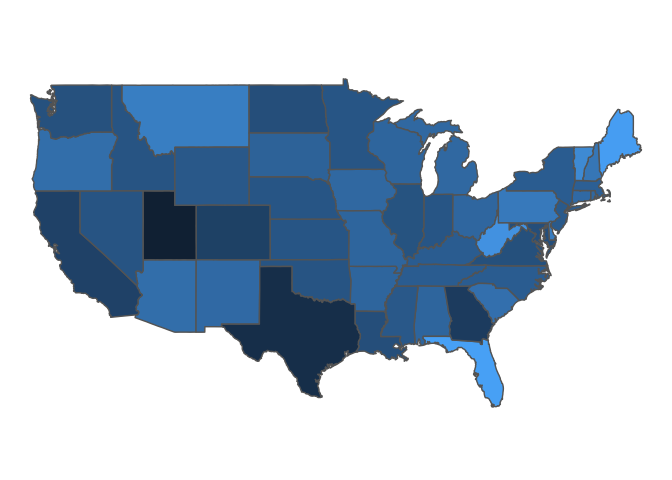

<!-- README.md is generated from README.Rmd. Please edit that file -->

# cspp: A Packge for The Correlates of State Policy Project Data

<!-- badges: start -->

<!-- badges: end -->

**cspp** is a package designed to allow a user with only basic knowledge
of R to find variables on state politics and policy, create and export
datasets from these variables, subset the datasets by states and years,
create map visualizations, and export citations to common file formats
(e.g., `.bib`).

## The Correlates of State Policy

[The Correlates of State Policy
Project](http://ippsr.msu.edu/public-policy/correlates-state-policy)
compiles more than 900 variables across 50 states from 1900-2016. The
variables cover 16 broad categories:

  - Demographics and Population
  - Economic and Fiscal Policy
  - Government
  - Elections
  - Policy Scores and Public Opinion
  - Criminal Justice and the Legal System
  - Education
  - Healthcare and Health Insurance
  - Welfare Policy
  - Rights and Anti-Discrimination Protections
  - Environment
  - Drug and Alcohol Policy
  - Gun Control
  - Labor
  - Transportation
  - Regulatory Policy

## Basic Use: Finding and Returning State Politics Data

The primary functions in this package are `get_var_info` and
`get_cspp_data`. The basic workflow for using this package is to 1) find
variables of interest and 2) pull them from the full data into a
dataframe within the R environment. Below is a basic working example.

``` r
# Load the package
library(cspp)

# Find variables based on a category
demo_variables <- get_var_info(categories = "demographics")

# Use these variables to get a full or subsetted version of the data
cspp_data <- get_cspp_data(vars = demo_variables$variable, 
                           years = seq(2000, 2010))
```

The `get_cspp_data` function returns a properly formatted state-year
panel facilitating regressions and merging based on common state
identifiers.

``` r
library(tibble)
glimpse(cspp_data[1:15],)
#> Rows: 561
#> Columns: 15
#> $ year          <int> 2000, 2000, 2000, 2000, 2000, 2000, 2000, 2000, 2000,...
#> $ st.abb        <chr> "AL", "AK", "AZ", "AR", "CA", "CO", "CT", "DE", "DC",...
#> $ stateno       <dbl> 1.0, 2.0, 3.0, 4.0, 5.0, 6.0, 7.0, 8.0, 8.5, 9.0, 10....
#> $ state         <chr> "Alabama", "Alaska", "Arizona", "Arkansas", "Californ...
#> $ state_fips    <int> 1, 2, 4, 5, 6, 8, 9, 10, 11, 12, 13, 15, 16, 17, 18, ...
#> $ state_icpsr   <int> 41, 81, 61, 42, 71, 62, 1, 11, 55, 43, 44, 82, 63, 21...
#> $ poptotal      <int> 4451687, 627428, 5166810, 2678217, 33998767, 4327788,...
#> $ popdensity    <dbl> NA, NA, NA, NA, NA, NA, NA, NA, NA, NA, NA, NA, NA, N...
#> $ popfemale     <dbl> 2300000, 302820, 2600000, 1400000, 17000000, 2100000,...
#> $ pctpopfemale  <dbl> NA, NA, NA, NA, NA, NA, NA, NA, NA, NA, NA, NA, NA, N...
#> $ popmale       <dbl> 2100000, 324112, 2600000, 1300000, 17000000, 2200000,...
#> $ pctpopmale    <dbl> NA, NA, NA, NA, NA, NA, NA, NA, NA, NA, NA, NA, NA, N...
#> $ popunder5     <dbl> 295992, 47591, 382386, 181585, 2500000, 297505, 22334...
#> $ pctpopunder14 <dbl> NA, NA, NA, NA, NA, NA, NA, NA, NA, NA, NA, NA, NA, N...
#> $ pop5to17      <dbl> 827430, 143126, 984561, 498784, 6800000, 803290, 6183...
```

Even more generally, you can load the entire set of variables and/or the
entire set of data (all 900+ variables) into R through passing these
functions without any parameters:

``` r
# All variables
all_variables <- get_var_info()

# Full dataset
all_data <- get_cspp_data()
```

## Finding Variables

Given the large number of variables in the data, we provide additional
functionality within `get_var_info` to search for variables based on
strings or categories. For instance, the following searches for `pop`
and `femal` within the variable name, returning 31 variables:

``` r
# Search for variables by name
get_var_info(var_names = c("pop","femal"))
#> # A tibble: 31 x 6
#>    variable  years   short_desc      long_desc          sources         category
#>    <chr>     <chr>   <chr>           <chr>              <chr>           <chr>   
#>  1 poptotal  1900-2~ Population tot~ Total population ~ "U.S. Census B~ demogra~
#>  2 popdensi~ 1975-1~ Population den~ Number of people ~ "http://www.ip~ demogra~
#>  3 popfemale 1994-2~ Female populat~ The number of res~ "CQ Press. 'St~ demogra~
#>  4 pctpopfe~ 2012-2~ Female populat~ Percentage of the~ "U.S. Census B~ demogra~
#>  5 popmale   1994-2~ Male population The number of res~ "CQ Press. 'St~ demogra~
#>  6 pctpopma~ 2012-2~ Male populatio~ Percentage of the~ "U.S. Census B~ demogra~
#>  7 popunder5 1994-2~ Population und~ The number of res~ "CQ Press. 'St~ demogra~
#>  8 pctpopun~ 2013-2~ Population und~ Percentage of the~ "U.S. Census B~ demogra~
#>  9 pop5to17  1994-2~ Population fro~ The number of res~ "CQ Press. 'St~ demogra~
#> 10 pop18to24 1994-2~ Population fro~ The number of res~ "CQ Press. 'St~ demogra~
#> # ... with 21 more rows
```

A similar line of code using the `related_to` parameter, instead of
`var_name`, searches within the name **and** the description fields,
returning 96 results:

``` r
# Search by name and description:
get_var_info(related_to = c("pop", "femal"))
#> # A tibble: 96 x 6
#>    variable  years   short_desc      long_desc          sources         category
#>    <chr>     <chr>   <chr>           <chr>              <chr>           <chr>   
#>  1 poptotal  1900-2~ Population tot~ Total population ~ "U.S. Census B~ demogra~
#>  2 popdensi~ 1975-1~ Population den~ Number of people ~ "http://www.ip~ demogra~
#>  3 popfemale 1994-2~ Female populat~ The number of res~ "CQ Press. 'St~ demogra~
#>  4 pctpopfe~ 2012-2~ Female populat~ Percentage of the~ "U.S. Census B~ demogra~
#>  5 popmale   1994-2~ Male population The number of res~ "CQ Press. 'St~ demogra~
#>  6 pctpopma~ 2012-2~ Male populatio~ Percentage of the~ "U.S. Census B~ demogra~
#>  7 popunder5 1994-2~ Population und~ The number of res~ "CQ Press. 'St~ demogra~
#>  8 pctpopun~ 2013-2~ Population und~ Percentage of the~ "U.S. Census B~ demogra~
#>  9 pop5to17  1994-2~ Population fro~ The number of res~ "CQ Press. 'St~ demogra~
#> 10 pop18to24 1994-2~ Population fro~ The number of res~ "CQ Press. 'St~ demogra~
#> # ... with 86 more rows
```

You can also return whole categories of variables. The full list of
variable categories is available within the help file for
`?get_cspp_data`. You can alternatively see the list of categories
through the below snippet of code.

``` r
# See variable categories:
unique(get_var_info()$category)
#>  [1] "demographics"     "economic-fiscal"  "environment"      "government"      
#>  [5] "elections"        "policy-ideology"  "criminal justice" "education"       
#>  [9] "healthcare"       "welfare"          "rights"           "drug-alcohol"    
#> [13] "gun control"      "labor"            "transportation"   "misc. regulation"
```

``` r
# Find variables by category:
var_cats <- get_var_info(categories = c("gun control", "labor"))
```

You can then use the variable column in this dataframe to pull data from
`get_cspp_data` through `var_cats$variable`, an example of which is
below.

Another option in finding a variable is to load the variables into a
dataframe and use RStudio’s filter feature to search:


## Pulling data

The function `get_cspp_data` takes the following parameters, all of
which are optional:

  - `vars` - The specific (exact match) variable(s) to pull. Takes a
    single variable or a vector of variable names.
  - `var_category` - The category or categories from which to pull.
    Takes a single category or vector of categories from the 16 listed
    above.
  - `states` - Select which states to grab data from. States must be
    abbreviated and can take a vector or individual state. See
    `?state.abb` for an easy way to load state abbreviations.
  - `years` - Takes a single year or a vector or sequence of years, such
    as `seq(2001, 2005)`.
  - `output` - Choose to write the resulting dataframe straight to a
    file. Optional outputs include `csv`, `dta`, or `rdata`.
  - `path` - If outputting the file, choose where to write it to. If
    left blank, the file will save to your working directory.

In this example, the resulting dataframe includes the variables
`c("sess_length", "hou_majority", "term_length")` as well as all
variables in the category `demographics` for North Carolina, Virgina,
and Georgia from 1994 to 2004.

``` r
# Get subsetted data and save to dataframe
data <- get_cspp_data(vars = c("sess_length", "hou_majority", "term_length"),
                      var_category = "demographics",
                      states = c("NC", "VA", "GA"),
                      years = seq(1995, 2004))
```

You can also pass the `get_var_info` function into the `vars` parameter
of `get_cspp_data`, skipping a step:

``` r
# Use get_var_info to generate variable vector inline
get_cspp_data(vars = get_var_info(related_to = "concealed carry")$variable,
              states = "NC",
              years = 1999)
#>   year st.abb stateno          state state_fips state_icpsr bjourn bprecc
#> 1 1999     NC      33 North Carolina         37          47      2      1
```

Where the two returned variables, `bjourn` and `bprecc`, deal with
concealed carry of guns in motor vehicles and whether state laws
pre-empt local laws, respectively.

### Citations

Each variable in the CSPP data was collected from external sources.
We’ve made it easy to cite the source of each variable you use with
the `get_cites` function.

This function takes a variable name or vector of variable names (such as
that generated by the `get_var_info` function) and returns a dataframe
of citations.

``` r
# Simple dataframe for one variable
get_cites(var_names = "poptotal")
#>       var_name
#> 1         cspp
#> 2 CSPP Dataset
#> 3     poptotal
#>                                                                                                                                                                                                                                                                                                                                        citation
#> 1 U.S. Census Bureau (http://www.census.gov/)\r\nOriginally provided by Stateminder: A data visualization project from Georgetown University. http://stateminder.org/ (no longer accessible online)\r\nFor 2012–2017: U.S. Census Bureau, American Fact Finder: https://www.census.gov/acs/www/data/data-tables-and-tools/american- factfinder/
#> 2                                                                                                                                                                                                                                                                                                                         [insert package cite]
#> 3                                                                                                                                                                           Jordan, Marty P. and Matt Grossmann. 2020. The Correlates of State Policy Project v.2.2. East Lansing, MI: Institute for Public Policy and Social Research (IPPSR).

# Using get_var_info to return variable citations
get_cites(var_names = get_var_info(related_to = "concealed carry")$variable)
#>       var_name
#> 1         cspp
#> 2 CSPP Dataset
#> 3       bjourn
#> 4       bprecc
#>                                                                                                                                                              citation
#> 1 Sorens, Jason, Fait Muedini, and William P. Ruger. 'State and Local Public Policies in 2006: A New Database.' State Politics & Policy Quarterly 8.3 (2008): 309–26.
#> 2 Sorens, Jason, Fait Muedini, and William P. Ruger. 'State and Local Public Policies in 2006: A New Database.' State Politics & Policy Quarterly 8.3 (2008): 309–26.
#> 3                                                                                                                                               [insert package cite]
#> 4 Jordan, Marty P. and Matt Grossmann. 2020. The Correlates of State Policy Project v.2.2. East Lansing, MI: Institute for Public Policy and Social Research (IPPSR).
```

There is also an option to output the citations to a .bib, .csv or .txt
file:

``` r
get_cites(var_names = "poptotal",
         write_out = TRUE,
         file_path = "~/path/to/file.csv",
         format = "csv")
```

## Maps and Choropleths

The `generate_map` function uses the CSPP data to generate US maps with
states filled in based on the value of a given variable (also called
choropleths). This function returns a `ggplot` object so it is highly
customizable. The optional parameters are:

  - `cspp_data` - A dataframe ideally generated by the `get_cspp_data`
    function. Any dataframe will work as long as it has the columns
    `st.abb`, `year`, and any additional column from which to fill in
    the map.
  - `var_name` - The specific variable to use to fill in the map. If
    left blank, it will take the first column after `year` and `st.abb`.
  - `average_years` - Default is FALSE. If set to TRUE, this returns a
    map that averages over all of the years per state in the dataframe.
    So if there are multiple years of population per state, it plots the
    average population per state in the panel.
  - `drop_NA_states` - By default, the function keeps states that are
    missing data, resulting in them being filled in as gray. If this is
    set to TRUE, the states are dropped. See the example below.
  - `poly_args` - A list of arguments that determine the aesthetics of
    state shapes. See `ggplot2::geom_polygon` for options.

**Note**: This function will attempt to plot any variable type; however,
plotting character or factor values on a map will likely result in a
hard to interpret graph.

``` r
library(ggplot2) # optional, but needed to remove legend

# Generates a map of the percentage of the population over 65
generate_map(get_cspp_data(var_category = "demographics"),
             var_name = "pctpopover65") +
  theme(legend.position = "none")
```


In this example, since the dataframe passed is generated by
`get_cspp_data(var_category = "demographics")` and contains all years
for all states in the data, the function by default returns the value of
the most recent year without missing data.

If you set `drop_NA_states` to TRUE, and pass the function a dataframe
containing only certain states, it only plots those states:

``` r
library(dplyr)
#> 
#> Attaching package: 'dplyr'
#> The following objects are masked from 'package:stats':
#> 
#>     filter, lag
#> The following objects are masked from 'package:base':
#> 
#>     intersect, setdiff, setequal, union


generate_map(get_cspp_data(var_category = "demographics") %>%
                dplyr::filter(st.abb %in% c("NC", "VA", "SC")),
              var_name = "pctpopover65",
              poly_args = list(color = "black"),
              drop_NA_states = TRUE) +
  theme(legend.position = "none")
```



Since this function returns a `ggplot` object, you can customize it
endlessly:

``` r
generate_map(get_cspp_data(var_category = "demographics") %>%
                dplyr::filter(st.abb %in% c("NC", "VA", "SC", "TN", "GA", "WV", "MS", "AL", "KY")),
              var_name = "pctpopover65",
              poly_args = list(color = "black"),
              drop_NA_states = TRUE) +
  scale_fill_gradient(low = "white", high = "red") +
  theme(legend.position = "none") +
  ggtitle("% Population Over 65")
```


# Contact

[**Caleb Lucas**](https://caleblucas.com/) - Ph.D. Candidate, Michigan
State University <br /> [**Josh McCrain**](http://joshuamccrain.com) -
Post-doc, IPPSR, Michigan State University
([Twitter](https://twitter.com/joshmccrain))
