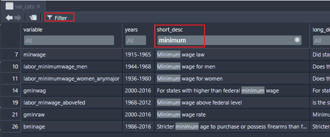

[The Correlates of State Policy Project](http://ippsr.msu.edu/public-policy/correlates-state-policy) compiles more than 900 variables across 50 states from 1900-2016. The variables cover 16 broad categories:

* Demographics and Population
* Economic and Fiscal Policy
* Government
* Elections
* Policy Scores and Public Opinion
* Criminal Justice and the Legal System
* Education
* Healthcare and Health Insurance
* Welfare Policy
* Rights and Anti-Discrimination Protections
* Environment
* Drug and Alcohol Policy
* Gun Control
* Labor
* Transportation
* Regulatory Policy

This package is designed to allow a user with only basic knowledge of R to find variables, create and export datasets from these variables, subset the datasets by states and years, create map visualizations, and export citations to common file formats (e.g., `.bib`).


## Basic Use: Finding and Returning State Politics Data

```{r eval=F}
# For latest developmental verison:
library(devtools)
install_github("correlatesstatepolicy/cspp")

# For CRAN version:
install.packages("cspp")
```


The primary functions in this package are `get_var_info` and `get_cspp_data`. The basic workflow for using this package is to 1) find variables of interest and 2) pull them from the full data into a dataframe within the R environment. Below is a basic working example.

```{r message = FALSE}
# Load the package
library(cspp)

# Find variables based on a category
demo_variables <- get_var_info(categories = "demographics")

# Use these variables to get a full or subsetted version of the data
cspp_data <- get_cspp_data(vars = demo_variables$variable, 
                           years = seq(2000, 2010))

```

The `get_cspp_data` function returns a properly formatted state-year panel, facilitating regressions and merging based on common state identifiers.
```{r}
library(dplyr)
glimpse(cspp_data[1:15],)
```


Even more generally, you can load the entire set of variables and/or the entire set of data (all 900+ variables) into R through passing these functions without any parameters:

```{r}
# All variables
all_variables <- get_var_info()

# Full dataset
all_data <- get_cspp_data()
```


## Finding Variables

Given the large number of variables in the data, we provide additional functionality within `get_var_info` to search for variables based on strings or categories. For instance, the following searches for `pop` and `femal` within the variable name, returning 31 variables:

```{r}
# Search for variables by name
get_var_info(var_names = c("pop","femal")) %>% dplyr::glimpse()
```

A similar line of code using the `related_to` parameter, instead of `var_name`, searches within the name **and** the description fields, returning 96 results:

```{r}
# Search by name and description:
get_var_info(related_to = c("pop", "femal")) %>% dplyr::glimpse()
```

You can also return whole categories of variables. The full list of variable categories is available within the help file for `?get_cspp_data`. You can alternatively see the list of categories through the below snippet of code.

```{r}
# See variable categories:
unique(get_var_info()$category)
```
```{r}
# Find variables by category:
var_cats <- get_var_info(categories = c("gun control", "labor"))
```

You can then use the variable column in this dataframe to pull data from `get_cspp_data` through `var_cats$variable`, an example of which is below.

Another option in finding a variable is to load the variables into a dataframe and use RStudio's filter feature to search:



## Pulling data

The function `get_cspp_data` takes the following parameters, all of which are optional:

* `vars` - The specific (exact match) variable(s) to pull. Takes a single variable or a vector of variable names.
* `var_category` - The category or categories from which to pull. Takes a single category or vector of categories from the 16 listed above.
* `states` - Select which states to grab data from. States must be abbreviated and can take a vector or individual state. See `?state.abb` for an easy way to load state abbreviations.
* `years` - Takes a single year or a vector or sequence of years, such as `seq(2001, 2005)`.
* `output` - Choose to write the resulting dataframe straight to a file. Optional outputs include `csv`, `dta`, or `rdata`.
* `path` - If outputting the file, choose where to write it to. If left blank, the file will save to your working directory.

In this example, the resulting dataframe includes the variables `c("sess_length", "hou_majority", "term_length")` as well as all variables in the category `demographics` for North Carolina, Virgina, and Georgia from 1994 to 2004.

```{r eval = F}
# Get subsetted data and save to dataframe
data <- get_cspp_data(vars = c("sess_length", "hou_majority", "term_length"),
                      var_category = "demographics",
                      states = c("NC", "VA", "GA"),
                      years = seq(1995, 2004))
```

You can also pass the `get_var_info` function into the `vars` parameter of `get_cspp_data`, skipping a step:

```{r}
# Use get_var_info to generate variable vector inline
get_cspp_data(vars = get_var_info(related_to = "concealed carry")$variable,
              states = "NC",
              years = 1999)
```

Where the two returned variables, `bjourn` and `bprecc`, deal with concealed carry of guns in motor vehicles and whether state laws pre-empt local laws, respectively.


### Citations

Each variable in the CSPP data was collected from external sources. We've made it easy to cite the source of each variable you use with the `get_cites` function.

This function takes a variable name or vector of variable names (such as that generated by the `get_var_info` function) and returns a dataframe of citations. 

```{r}
# Simple dataframe for one variable
get_cites(var_names = "poptotal") %>% dplyr::glimpse()

# Using get_var_info to return variable citations
cite_ex <- get_cites(var_names = get_var_info(related_to = "concealed carry")$variable)
cite_ex$plaintext_cite[3:4]
```

There is also an option to output the citations to a .bib, .csv or .txt file:

```{r eval=F}
get_cites(var_names = "poptotal",
         write_out = TRUE,
         file_path = "~/path/to/file.csv",
         format = "csv")
```


## Maps and Choropleths

The `generate_map` function uses the CSPP data to generate US maps with states filled in based on the value of a given variable (also called choropleths). This function returns a `ggplot` object so it is highly customizable. The optional parameters are:

* `cspp_data` - A dataframe ideally generated by the `get_cspp_data` function. Any dataframe will work as long as it has the columns `st`, `year`, and any additional column from which to fill in the map.
* `var_name` - The specific variable to use to fill in the map. If left blank, it will take the first column after `year` and `st`.
* `average_years` - Default is FALSE. If set to TRUE, this returns a map that averages over all of the years per state in the dataframe. So if there are multiple years of population per state, it plots the average population per state in the panel.
* `drop_NA_states` - By default, the function keeps states that are missing data, resulting in them being filled in as gray. If this is set to TRUE, the states are dropped. See the example below.
* `poly_args` - A list of arguments that determine the aesthetics of state shapes. See `ggplot2::geom_polygon` for options.

**Note**: This function will attempt to plot any variable type; however, plotting character or factor values on a map will likely result in a hard to interpret graph.

```{r out.width='60%'}
library(ggplot2) # optional, but needed to remove legend

# Generates a map of the percentage of the population over 65
generate_map(get_cspp_data(var_category = "demographics"),
             var_name = "pctpopover65") +
  ggplot2::theme(legend.position = "none")
```

In this example, since the dataframe passed is generated by `get_cspp_data(var_category = "demographics")` and contains all years for all states in the data, the function by default returns the value of the most recent year without missing data.


If you set `drop_NA_states` to TRUE, and pass the function a dataframe containing only certain states, it only plots those states:
```{r out.width='60%'}
library(dplyr)

generate_map(get_cspp_data(var_category = "demographics") %>%
                dplyr::filter(st %in% c("NC", "VA", "SC")),
              var_name = "pctpopover65",
              poly_args = list(color = "black"),
              drop_NA_states = TRUE) +
  ggplot2::theme(legend.position = "none")
```

Since this function returns a `ggplot` object, you can customize it endlessly:
```{r out.width='60%'}
generate_map(get_cspp_data(var_category = "demographics") %>%
                dplyr::filter(st %in% c("NC", "VA", "SC", "TN", "GA", "WV", "MS", "AL", "KY")),
              var_name = "pctpopover65",
              poly_args = list(color = "black"),
              drop_NA_states = TRUE) +
  ggplot2::scale_fill_gradient(low = "white", high = "red") +
  ggplot2::theme(legend.position = "none") +
  ggplot2::ggtitle("% Population Over 65")
```

## Plot timeseries data
To facilitate the visualization of the timeseries and panel nature of the CSPP data, the `plot_panel` function takes a dataframe from `get_cspp_data` and plots a state-year panel in one of two formats. The parameters of this function are as follows:

* `cspp_data` - a dataframe generated by `get_cspp_data` or, alternatively, a dataframe with the columns `st`, `year`, plus one other variable.
* `var_name` - the name of the variable to be plotted.
* `years` - the years to include in the panel.
* `colors` - three color values that are used in the plot. The first color takes the lowest values of the variable, the second the highest, and the third is the color used for NA values.
* `plot_type` - one of "grid" or "line". Defaults to "grid". Both are displayed next.

The function returns a `ggplot2` object, making it easier to change and add layers onto the generated plot.

A common research design is to use variation in policy adoption as a 'treatment' in a pseudo-experimental setting. This function makes it easy to visualize when states are subject to this treatment.

```{r out.width="100%", dpi=180}
# panel of all states' adoption of medical marijuana laws
cspp <- get_cspp_data(vars = "drugs_medical_marijuana")

# visualize panel:
plot_panel(cspp)
```

The function also works with continuous variables, such as the state policy liberalism score:

```{r, out.width="100%", dpi=180}
plot_panel(cspp_data = get_cspp_data(vars = "pollib_median"),
           colors = c("firebrick4", "steelblue2", "gray"),
           years = seq(1960, 2010)) +
  ggplot2::ggtitle("Policy liberalism")
```

## Network data
The function `get_network_data` returns a dataset from the [CSPP state networks data](http://ippsr.msu.edu/public-policy/state-networks) consisting of 120 variables. The data is structured as state dyads (an edge list).

```{r}
# Returns dataframe of state dyads
get_network_data() %>% dplyr::glimpse()
```

The function has two optional parameters `category` and `merge_data`. If a category or string of categories is specified, it returns variables only in that category (see the data documentation in the link above). Category options are "Distance Travel Migration", "Economic", "Political", "Policy", "Demographic".

```{r}
network.df <- get_network_data(category = c("Economic", "Political"))

names(network.df)
```

`merge_data` simplifies merging in data from the `get_cspp_data` function. The object passed to `merge_data` must be a dataframe with a variable named `st`, or a dataframe generated by `get_cspp_data`. If the dataframe passed to this parameter has more than one observation per state (a panel) then this function averages over all values per state prior to merging.

```{r}
cspp_data <- get_cspp_data(vars = c("sess_length", "hou_majority"), years = seq(1999, 2000))

network.df <- get_network_data(category = "Distance Travel Migration",
                               merge_data  = cspp_data)

names(network.df)

library(dplyr)

head(cspp_data %>% arrange(st))
# the merged value of Alaska's hou_majority value will be mean(c(-0.129, -0.115))

```
 
### Network Plotting Examples
 
 Here are two examples of plotting the state network edgelist data using `igraph` and `ggraph`:
 
```{r message=F, warning=F, dpi=180}
library(ggraph)
library(igraph)

network.df <- select(network.df, from = st.abb1, to = st.abb2, ACS_Migration) 

network.df %>% 
  filter(from %in% c("NC", "VA", "SC", "GA")) %>% 
  graph_from_data_frame() %>% 
  ggraph(layout="fr") + 
  geom_edge_link(aes(edge_alpha = ACS_Migration), edge_color = "royalblue") + 
  geom_node_point() +
  geom_node_text(aes(label = name), repel = TRUE, point.padding = unit(0.2, "lines")) +
  theme_void() +
  theme(legend.position = "none")
```


```{r message=F, warning=F, dpi=180}
network.df %>% 
  filter(from %in% c("NC")) %>% 
  graph_from_data_frame() %>% 
  ggraph(layout="linear") + 
  geom_edge_arc(aes(edge_alpha = ACS_Migration), edge_color = "royalblue") + 
  geom_node_text(aes(label = name), size = 2) +
  theme_void() +
  theme(legend.position = "none")
```
 
 
 
